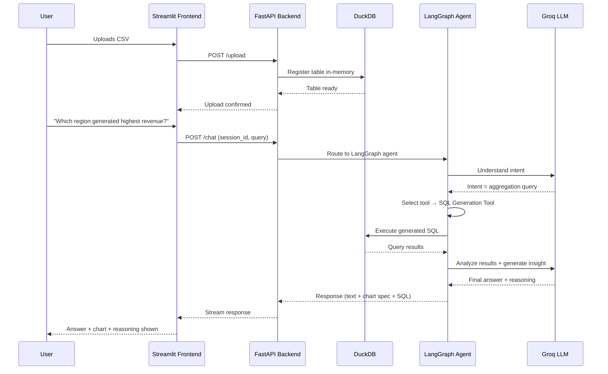

<div align="center">

# 🧠 DataMind AI

### Agentic AI Powered Conversational Data Analyst

**Ask your data anything. Get SQL, insights, charts, and anomalies — instantly.**

[](https://www.python.org/)
[](https://fastapi.tiangolo.com/)
[](https://www.langchain.com/langgraph)
[](https://streamlit.io/)
[](https://groq.com/)
[](https://www.docker.com/)
[](LICENSE)


</div>

---

## 📋 Table of Contents

- [Overview](#-overview)
- [Why This Project Exists](#-why-this-project-exists)
- [Key Features](#-key-features)
- [Feature Comparison](#-feature-comparison)
- [Architecture](#-architecture)
- [Agent Workflow](#-agent-workflow)
- [Folder Structure](#-folder-structure)
- [Installation](#-installation)
- [Local Setup](#-local-setup)
- [Environment Variables](#-environment-variables)
- [Docker Deployment](#-docker-deployment)
- [Railway Deployment](#-railway-deployment)
- [Render Deployment](#-render-deployment)
- [Streamlit Deployment](#-streamlit-cloud-deployment)
- [API Endpoints](#-api-endpoints)
- [Screenshots](#-screenshots)
- [Example User Queries](#-example-user-queries)
- [Example AI Response](#-example-ai-response)
- [Sample Generated SQL](#-sample-generated-sql)
- [Performance Highlights](#-performance-highlights)
- [Security Features](#-security-features)
- [Session Management](#-session-management)
- [Error Handling](#-error-handling)
- [Data Privacy](#-data-privacy)
- [Future Roadmap](#-future-roadmap)
- [Contributing](#-contributing)
- [License](#-license)
- [Acknowledgements](#-acknowledgements)
- [Contact](#-contact)

---

## 🔍 Overview

**DataMind AI** is an enterprise-grade **Agentic AI platform** that turns raw CSV datasets into a conversational analytics experience. Instead of writing SQL, building pivot tables, or wrestling with spreadsheets, users simply **ask a question in plain English** — and an autonomous LangGraph agent handles the rest: understanding intent, writing and executing SQL against DuckDB, analyzing the results, generating interactive visualizations, flagging anomalies, and explaining its own reasoning.

This isn't a thin wrapper around an LLM API. It's a full **agentic pipeline** with tool orchestration, session-aware memory, structured error handling, and a production-style architecture designed to scale from a single CSV to multi-file, multi-session enterprise workloads.

> [!TIP]
> Think of it as "ChatGPT for your spreadsheets" — but self-hosted, transparent about its reasoning, and built to show its work (SQL, charts, and all).

---

## 💡 Why This Project Exists

Business teams generate mountains of CSV data but rarely have a data analyst on call. Traditional BI tools require dashboards to be pre-built, and raw SQL is inaccessible to non-technical stakeholders.

**DataMind AI closes that gap** by combining:

- 🗣️ **Natural language understanding** — no SQL knowledge required
- 🤖 **Autonomous agent reasoning** — the AI decides *which* tool to use, not a hardcoded if-else chain
- 📊 **Instant visual + statistical answers** — charts and anomaly detection generated on demand
- 🔍 **Full transparency** — every answer comes with the SQL/Pandas code and reasoning behind it

---

## ✨ Key Features

<table>
<tr>
<td width="50%" valign="top">

### 🗨️ Natural Language Analytics
- Upload one or multiple CSV datasets
- Ask questions in plain English
- Session-based conversation memory
- Multi-turn contextual follow-ups

### ⚡ SQL & Query Engine
- Automatic SQL generation (DuckDB)
- Transparent query execution
- Pandas fallback for complex ops
- Reasoning traces for every answer

### 📈 Visualization
- Interactive Plotly charts (Bar/Line/Pie/Scatter)
- Auto dashboard generation
- Correlation analysis
- Trend detection

</td>
<td width="50%" valign="top">

### 🧹 Data Quality
- Missing value detection
- Duplicate row detection
- Column-level statistics
- Automated data quality reports

### 🚨 Anomaly Detection
- IQR-based outlier detection
- Z-Score statistical flags
- Isolation Forest (ML-based)
- Plain-English explanations for flags

### 📤 Export & UX
- Export chat as Markdown / PDF
- Download results as CSV
- Streaming responses
- Dark, responsive, modern UI

</td>
</tr>
</table>

---

## 📊 Feature Comparison

| Capability | Excel/Sheets | Traditional BI Tools | DataMind AI |
|---|:---:|:---:|:---:|
| Natural language querying | ❌ | ⚠️ Limited | ✅ |
| Requires pre-built dashboards | ❌ N/A | ✅ Yes | ❌ No |
| Auto SQL generation | ❌ | ❌ | ✅ |
| Anomaly detection (statistical + ML) | ❌ | ⚠️ Add-on | ✅ Built-in |
| Explains its own reasoning | ❌ | ❌ | ✅ |
| Multi-file relational analysis | ⚠️ Manual | ✅ | ✅ |
| Self-hostable / open source | ❌ | ❌ | ✅ |
| Conversational memory | ❌ | ❌ | ✅ |

---

## 🏗️ Architecture


---

## 🔄 Agent Workflow



---

## 📁 Folder Structure

```
DataMind-AI/
├── agent/                     # LangGraph agentic core
│   ├── graph.py                # LangGraph state graph definition
│   ├── prompts/                # Prompt templates
│   └── tools/                  # Agent tools (SQL, charts, anomalies, insights)
│
├── api/                        # FastAPI backend
│   ├── main.py
│   ├── routes/
│   │   ├── upload.py
│   │   ├── chat.py
│   │   ├── dashboard.py
│   │   └── stream.py
│   └── schemas/                # Pydantic models
│
├── core/                       # Core services
│   ├── config.py
│   ├── session_manager.py
│   ├── duckdb_manager.py
│   ├── quality_analyzer.py
│   └── logger.py
│
├── frontend/                   # Streamlit application
│   ├── app.py
│   ├── pages/
│   │   ├── 1_Upload.py
│   │   ├── 2_Chat.py
│   │   └── 3_Dashboard.py
│   ├── utils/
│   └── exports/
│
├── tests/                      # Pytest test suite
├── data/                       # Sample datasets
├── images/                     # Screenshots & banner assets
├── logs/                       # Runtime logs
├── Dockerfile.backend
├── Dockerfile.frontend
├── docker-compose.yml
├── render.yaml
├── requirements.txt
├── requirements-frontend.txt
├── .env.example
└── README.md
```

---

## 🚀 Installation

### Prerequisites

| Requirement | Version |
|---|---|
| Python | 3.11+ |
| Docker & Docker Compose | Latest (recommended) |
| Groq API Key | [console.groq.com](https://console.groq.com) |

```bash
git clone https://github.com/Harsh28-raj/datamind-ai.git
cd datamind-ai
```

---

## 🛠️ Local Setup

<details>
<summary><b>Click to expand full local setup steps</b></summary>

```bash
# 1. Create virtual environment
python -m venv venv
source venv/bin/activate      # Windows: venv\Scripts\activate

# 2. Install backend dependencies
pip install -r requirements.txt

# 3. Install frontend dependencies
pip install -r requirements-frontend.txt

# 4. Configure environment variables
cp .env.example .env
# Edit .env and add your GROQ_API_KEY

# 5. Run the backend
uvicorn api.main:app --reload --port 8000

# 6. Run the frontend (in a new terminal)
streamlit run frontend/app.py
```

App will be available at:
- Backend → `http://localhost:8000`
- Frontend → `http://localhost:8501`

</details>

---

## 🔐 Environment Variables

Create a `.env` file in the project root:

```env
# DataMind AI Environment Configuration (Groq Cloud API)
GROQ_API_KEY=your_groq_api_key_here
MODEL_NAME=llama-3.3-70b-versatile

LOG_LEVEL=INFO
MAX_FILE_SIZE_MB=50
BACKEND_HOST=0.0.0.0
BACKEND_PORT=8000

LANGCHAIN_TRACING_V2=false
LANGCHAIN_API_KEY=
```

> [!WARNING]
> Never commit your real `.env` file. Only `.env.example` should be tracked in git.

---

## 🐳 Docker Deployment

```bash
# Build and run both services
docker-compose up --build

# Run in detached mode
docker-compose up -d --build

# Stop services
docker-compose down
```

| Service | Port | URL |
|---|---|---|
| Backend (FastAPI) | 8000 | http://localhost:8000/docs |
| Frontend (Streamlit) | 8501 | http://localhost:8501 |

---

## 🚂 Railway Deployment

1. Push your repo to GitHub
2. Go to [railway.app](https://railway.app) → **New Project → Deploy from GitHub Repo**
3. Add environment variables from `.env.example` in the Railway dashboard
4. Railway auto-detects the `Dockerfile.backend` — set the start command if needed
5. Deploy and copy the generated public URL

---

## 🎨 Render Deployment

This repo includes a ready-to-use `render.yaml`:

```bash
# Render will auto-provision services defined in render.yaml
```

1. Connect your GitHub repo on [render.com](https://render.com)
2. Select **"New Blueprint Instance"** and point to `render.yaml`
3. Add `GROQ_API_KEY` as a secret environment variable
4. Deploy — Render builds both backend and frontend services automatically

---

## ☁️ Streamlit Cloud Deployment

1. Push repo to GitHub
2. Go to [share.streamlit.io](https://share.streamlit.io)
3. Select repo → set main file path to `frontend/app.py`
4. Add `GROQ_API_KEY` under **Secrets**
5. Deploy

---

## 🔌 API Endpoints

| Method | Endpoint | Description |
|---|---|---|
| `POST` | `/upload` | Upload and validate one or more CSV files |
| `POST` | `/chat` | Send a natural language query to the agent |
| `POST` | `/chat/stream` | Streaming version of the chat endpoint |
| `GET` | `/session/{id}/history` | Retrieve conversation history for a session |
| `POST` | `/anomalies` | Run anomaly detection on a dataset |
| `GET` | `/dashboard/{session_id}` | Auto-generated dashboard summary |
| `GET` | `/health` | Health check endpoint |

<details>
<summary><b>Example request/response</b></summary>

```bash
curl -X POST http://localhost:8000/chat \
  -H "Content-Type: application/json" \
  -d '{
        "session_id": "abc123",
        "query": "Which region generated the highest revenue?"
      }'
```

```json
{
  "answer": "The North region generated the highest revenue at ₹4.2M, 18% above the next closest region.",
  "chart": { "type": "bar", "data": "..." },
  "sql": "SELECT region, SUM(revenue) AS total_revenue FROM sales GROUP BY region ORDER BY total_revenue DESC LIMIT 1;",
  "reasoning": "Aggregation query detected → routed to SQL Generation Tool → executed against DuckDB."
}
```

</details>

---

## 🖼️ Screenshots

| Upload | Chat |
|---|---|
|  |  |

| Dashboard | Report |
|---|---|
|  |  |

---

## 💬 Example User Queries

- "Which region generated the highest revenue?"
- "Show monthly sales trend."
- "Generate SQL for this analysis."
- "Find anomalies in the dataset."
- "Show top 5 customers by revenue."
- "Compare product categories by units sold."
- "Create a dashboard for this dataset."

---

## 🤖 Example AI Response

> **Q: "Which products are underperforming?"**
>
> **A:** Based on units sold and revenue contribution, 4 products fall below the 25th percentile threshold across both metrics — most notably *Product C*, which sold 62% fewer units than the category average this quarter. I flagged these using an IQR-based analysis on `units_sold` and `revenue` grouped by product.
>
> 📊 *[Bar chart of underperforming products attached]*
> 🧾 *[Generated SQL available in the response panel]*

---

## 🧾 Sample Generated SQL

```sql
SELECT
    product,
    SUM(units_sold) AS total_units,
    SUM(revenue) AS total_revenue
FROM sales_data
GROUP BY product
HAVING total_units < (
    SELECT PERCENTILE_CONT(0.25) WITHIN GROUP (ORDER BY units_sold)
    FROM sales_data
)
ORDER BY total_units ASC;
```

---

## ⚡ Performance Highlights

- 🚀 Sub-second SQL execution via **DuckDB** (columnar, in-memory OLAP engine)
- ⚡ Powered by **Groq Cloud's LPU inference** — some of the fastest LLM response times available
- 📦 Handles datasets up to **50MB** per file out of the box (configurable)
- 🔄 Streaming responses for near-instant perceived latency

---

## 🔒 Security Features

- API keys loaded exclusively via environment variables — never hardcoded
- Input validation and sanitization on all file uploads
- Session isolation — one user's data is never accessible to another session
- No raw stack traces exposed to the frontend

---

## 🗂️ Session Management

- Each upload creates an isolated, session-scoped DuckDB context
- Conversation history maintained per `session_id` via LangGraph checkpointing
- Sessions are held in-memory for the runtime of the app (no persistent storage of user data by default)

---

## 🛡️ Error Handling

- Structured exception handling across all API routes with meaningful HTTP status codes
- Malformed CSV / encoding issues caught and reported with clear user-facing messages
- Graceful degradation if the LLM provider is unreachable (with retry logic)

---

## 🕵️ Data Privacy

- Uploaded files are processed **in-memory** and are not persisted to disk by default
- No data is sent anywhere other than the configured LLM provider for query understanding
- Fully self-hostable — run entirely within your own infrastructure

---

## 🛣️ Future Roadmap

- [ ] 🔐 Authentication & multi-user support
- [ ] 📚 RAG-based semantic search across historical datasets
- [ ] 🔗 Native database connectors (Postgres, MySQL, MongoDB)
- [ ] 📊 Excel & Power BI export integrations
- [ ] ❄️ Snowflake & BigQuery connectors
- [ ] 🎙️ Voice assistant mode
- [ ] 🕸️ Multi-agent collaboration (specialized sub-agents per domain)
- [ ] 🔌 MCP (Model Context Protocol) tool integration

---

## 🤝 Contributing

Contributions are welcome! To contribute:

1. Fork the repository
2. Create a feature branch (`git checkout -b feature/amazing-feature`)
3. Commit your changes (`git commit -m 'Add amazing feature'`)
4. Push to the branch (`git push origin feature/amazing-feature`)
5. Open a Pull Request

Please ensure tests pass (`pytest`) before submitting.

---

## 📄 License

This project is licensed under the **MIT License** — see the [LICENSE](LICENSE) file for details.

---

## 🙏 Acknowledgements

- [LangChain](https://www.langchain.com/) & [LangGraph](https://www.langchain.com/langgraph) for the agentic framework
- [Groq](https://groq.com/) for blazing-fast LLM inference
- [DuckDB](https://duckdb.org/) for the embedded analytical engine
- [Streamlit](https://streamlit.io/) for rapid UI development

---

## 📬 Contact

**Harsh Raj**

[](https://github.com/Harsh28-raj)
[](https://linkedin.com/in/harsh-raj4308g)
[](mailto:your-email@example.com)

<div align="center">

⭐ **If you find this project useful, consider giving it a star!** ⭐

</div>
