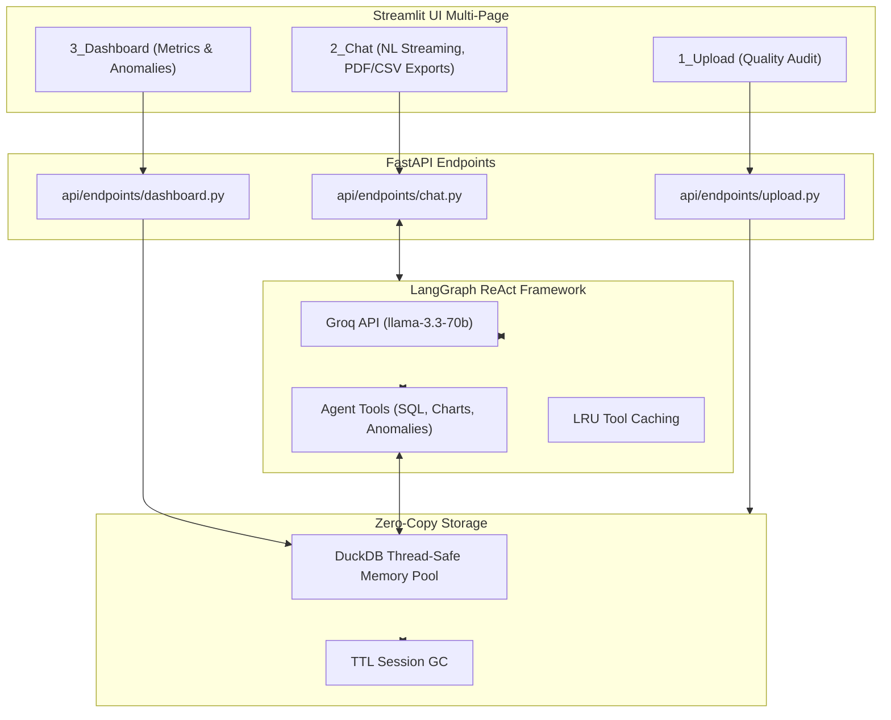

# DataMind AI — Enterprise Data Analyst (Groq Cloud Edition)

[](https://fastapi.tiangolo.com/)
[](https://streamlit.io/)
[](https://console.groq.com)
[](https://www.docker.com/)
[](https://render.com/)

**DataMind AI** is a production-ready, autonomous AI Data Analyst. It allows users to upload single or multi-CSV datasets and interact with their data using natural language. 

Powered by the **Groq Cloud API (`llama-3.3-70b-versatile`)** and a **LangGraph ReAct agent architecture**, DataMind AI answers analytical questions, generates interactive Plotly visualizations, transparently reveals its DuckDB SQL/Pandas code, performs statistical anomaly detection (IQR, Z-score, Isolation Forest), and instantly exports PDF/CSV executive reports.

---

## 🏗 Architecture & Folder Structure

```text
📦 datamind-ai
 ┣ 📂 agent/            # LangGraph ReAct Agent & LLM Tools
 ┣ 📂 api/              # FastAPI Backend Services
 ┃ ┣ 📂 endpoints/      # Modular REST Routes (upload, chat, dashboard)
 ┃ ┣ 📜 main.py         # FastAPI Entrypoint
 ┃ ┗ 📜 schemas.py      # Pydantic Request/Response Models
 ┣ 📂 core/             # Application Core Services
 ┃ ┣ 📜 config.py       # Pydantic Settings & Environment
 ┃ ┣ 📜 duckdb_manager.py # Zero-Copy In-Memory SQL Execution
 ┃ ┗ 📜 session.py      # Stateful Thread-Safe Session Store & Garbage Collector
 ┣ 📂 frontend/         # Streamlit Application
 ┃ ┣ 📂 pages/          # UI Views (Upload, Chat, Dashboard)
 ┃ ┣ 📜 app.py          # Streamlit Entrypoint
 ┃ ┗ 📜 style.css       # Premium Glassmorphism UI/UX
 ┣ 📜 render.yaml       # Render.com IaC Deployment Spec
 ┣ 📜 railway.json      # Railway PaaS Deployment Spec
 ┣ 📜 docker-compose.yml# Local Multi-Container Deployment
 ┗ 📜 requirements*.txt # Dependency Definitions
```

### 🧠 LangGraph Execution Flow


---

## 🚀 Deployment Guide

DataMind AI is built for immediate deployment across multiple PaaS providers and local Docker environments.

### 🐳 Docker Compose (Local)
Spin up the decoupled frontend and backend instantly:
```bash
docker-compose up --build
```
- **Frontend**: `http://localhost:8501`
- **Backend API Docs**: `http://localhost:8000/docs`

### 🌐 Render
This repository includes a production-ready `render.yaml`.
1. Connect this GitHub repository to Render.
2. Select **New Blueprint Instance**.
3. Render will automatically provision both the FastAPI backend and Streamlit frontend.

### 🚂 Railway
This repository includes a `railway.json`.
1. Connect your repository to Railway.
2. Railway will parse the configuration and build the environment via Nixpacks.

### ☁️ Streamlit Cloud
1. Deploy `frontend/app.py` directly to Streamlit Community Cloud.
2. Set the `BACKEND_URL` environment variable in your Streamlit Cloud settings to point to your live FastAPI backend.
3. The `.streamlit/config.toml` will ensure the dark-mode theme remains synchronized.

---

## ⚙️ Local Development Setup

1. **Clone & Environment**:
```bash
python -m venv venv
source venv/bin/activate  # Windows: venv\Scripts\activate
```

2. **Backend**:
```bash
pip install -r requirements.txt
cp .env.example .env
uvicorn api.main:app --reload --host 0.0.0.0 --port 8000
```

3. **Frontend**:
```bash
pip install -r requirements-frontend.txt
streamlit run frontend/app.py
```

---

## 📄 Licensing & Security
- **Data Privacy**: CSV data resides entirely within the ephemeral DuckDB memory pool and is purged aggressively by the Session Garbage Collector. No data is stored persistently to disk.
- **API Integrity**: Ensure `GROQ_API_KEY` is secured in your cloud platform's secret manager.
