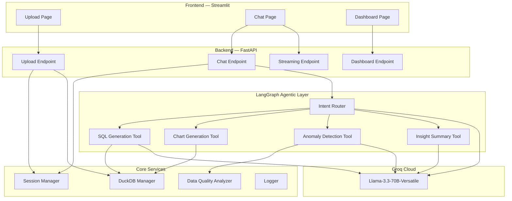
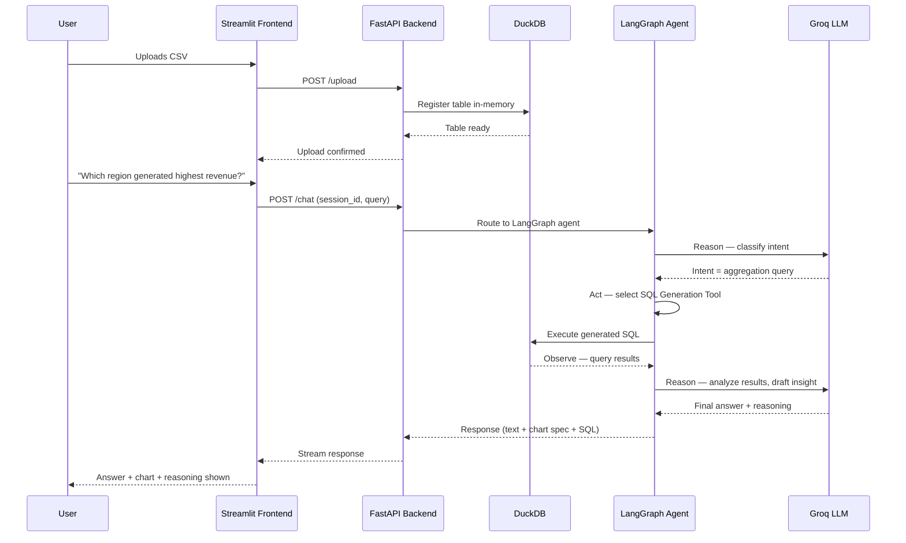

<div align="center">


<br/>

# DataMind AI

### Agentic AI-Powered Conversational Data Analyst

**Ask your data anything, in plain English — get SQL, insights, charts, and anomaly reports, instantly.**

An autonomous **LangGraph** agent that reasons over your CSV data the way a human analyst would: understanding intent, generating SQL and Pandas code, executing it, visualizing results, and explaining every step of its reasoning.

<br/>

[](https://www.python.org/)
[](https://fastapi.tiangolo.com/)
[](https://www.langchain.com/langgraph)
[](https://streamlit.io/)
[](https://groq.com/)
[](https://duckdb.org/)
[](https://www.docker.com/)
[](#license)

[**Live Demo**](https://datamind-ai-frontend.onrender.com) ·
[**API Docs (Swagger)**](https://datamind-ai-backend.onrender.com/docs) ·
[**OpenAPI Spec**](https://datamind-ai-backend.onrender.com/openapi.json) ·
[**Report Bug**](https://github.com/Harsh28-raj/agentic-ai-data-analyst/issues) ·
[**Request Feature**](https://github.com/Harsh28-raj/agentic-ai-data-analyst/issues)

</div>

---

## Table of Contents

<table>
<tr>
<td valign="top">

**Getting Started**
- [Overview](#overview)
- [Live Demo](#live-demo)
- [Project Highlights](#project-highlights)
- [Why Agentic AI?](#why-agentic-ai)
- [Key Features](#key-features)
- [Feature Comparison](#feature-comparison)

**Design**
- [System Architecture](#system-architecture)
- [Agent Workflow (ReAct)](#agent-workflow-react-pattern)
- [AI Pipeline Explained](#ai-pipeline-explained)
- [Technology Rationale](#technology-rationale)
- [Tech Stack](#tech-stack)
- [Project Structure](#project-structure)

</td>
<td valign="top">

**Running It**
- [Quick Start](#quick-start)
- [Local Development](#local-development)
- [Environment Variables](#environment-variables)
- [Docker Deployment](#docker-deployment)
- [Production Deployment](#production-deployment)
- [API Overview](#api-overview)

**More**
- [Screenshots](#screenshots)
- [Example Queries](#example-user-queries)
- [Implementation Notes](#implementation-notes)
- [Performance & Scalability](#performance--scalability)
- [Security](#security)
- [Known Limitations](#known-limitations)
- [Roadmap](#roadmap--future-improvements)
- [Contributing](#contributing)
- [Author](#author)

</td>
</tr>
</table>

---

## Overview

**DataMind AI** is an agentic AI platform that turns raw CSV datasets into a conversational analytics experience. Instead of writing SQL, wrangling pivot tables, or waiting on a BI team, users simply **ask a question in plain English** — and an autonomous LangGraph agent handles the rest: understanding intent, generating and executing SQL (and, where appropriate, Pandas code), analyzing results, producing interactive visualizations, flagging anomalies, and explaining exactly how it got there.

This is not a thin wrapper around an LLM API call. It is a full agentic pipeline with tool orchestration, session-aware memory, structured error handling, and a production-style architecture designed to scale from a single CSV to multi-file, multi-session workloads.

Built as part of an AI Engineer Assignment to demonstrate production-ready Agentic AI application development using LangGraph, FastAPI, DuckDB and Groq.

> [!TIP]
> Think of it as a data analyst who never sleeps — self-hosted, transparent about its reasoning, and built to show its work: the SQL (or Pandas code), the chart, and the *why*, every single time.

---

## Live Demo

| Resource | Link |
|---|---|
| Frontend (Streamlit App) | [datamind-ai-frontend.onrender.com](https://datamind-ai-frontend.onrender.com) |
| Backend API (Swagger UI) | [datamind-ai-backend.onrender.com/docs](https://datamind-ai-backend.onrender.com/docs) |
| OpenAPI Specification | [datamind-ai-backend.onrender.com/openapi.json](https://datamind-ai-backend.onrender.com/openapi.json) |
| Demo Video | [Watch on Google Drive](https://drive.google.com/file/d/1ASdg6JpVdXVTUazEbHddKAfvzE8P1Vts/view?usp=sharing) |

> [!NOTE]
> The backend runs on Render's free tier and may take up to a minute to spin up after a period of inactivity. Please allow the first request some time to complete.

---

## Project Highlights

> A quick-scan summary for recruiters, hiring managers, and technical reviewers.

| | |
|---|---|
| **Agentic, not scripted** | Built on LangGraph's stateful graph model with autonomous tool selection — not a hardcoded if/else chain |
| **Production-grade backend** | FastAPI + Pydantic schemas, structured logging, and typed, modular services |
| **Full reasoning transparency** | Every response includes the generated SQL or Pandas code, the chosen tool, and a plain-English explanation |
| **Real analytical depth** | Statistical (IQR, Z-Score) and ML-based (Isolation Forest) anomaly detection — not a single naive method |
| **Executive-level insights** | AI-generated executive summaries and suggested follow-up questions, not just raw answers |
| **Deployment-ready** | Dockerized, with live Render deployments for both frontend and backend |
| **Tested** | Pytest suite covering core agent tools, validation logic, and anomaly detection |
| **Clean architecture** | Clear separation of `agent/`, `api/`, `core/`, and `frontend/`, each with a single responsibility |

---

## Why Agentic AI?

A traditional LLM integration takes a prompt and returns text. DataMind AI's agent decides what to *do*.

Given a query like *"Which products are underperforming, and why?"*, the agent autonomously:

1. Recognizes this needs **both** an aggregation query *and* a statistical outlier check
2. Selects the **SQL Generation Tool**, then the **Anomaly Detection Tool** — in sequence, without being told to
3. Passes intermediate results between tools, reasoning over each output before deciding the next step
4. Synthesizes a single, coherent answer with supporting SQL and a chart

This tool-orchestration behavior — reason, act, observe, repeat — is the **ReAct pattern**, and it is what separates an agent from a chatbot with API access.

<details>
<summary><b>Why LangGraph specifically?</b></summary>

<br/>

LangGraph models the agent as an explicit **state graph** rather than a linear chain, which gives DataMind AI:

- **Conditional routing** — the agent can branch to different tools based on intent, not a fixed sequence
- **Persistent state and checkpointing** — conversation memory survives across turns within a session
- **Cyclical reasoning** — the agent can loop back (e.g., re-query after an empty result) instead of failing silently
- **Observability** — every state transition is inspectable, which is critical for debugging agent behavior in production

</details>

<details>
<summary><b>Why DuckDB specifically?</b></summary>

<br/>

DuckDB is an embedded, columnar **OLAP** engine, effectively "SQLite for analytics":

- **Zero infrastructure** — runs in-process, no separate database server to deploy or manage
- **Blazing-fast aggregations** — columnar storage makes `GROUP BY`, `SUM`, and window functions dramatically faster than row-based engines on analytical workloads
- **Native Pandas/CSV interop** — CSVs and DataFrames can be queried directly with zero ETL step
- **Real SQL** — the agent generates and executes actual SQL, not a pseudo-query DSL

</details>

<details>
<summary><b>Why Groq specifically?</b></summary>

<br/>

Groq's LPU (Language Processing Unit) inference stack serves **Llama-3.3-70B-Versatile** at extremely low latency:

- **Speed** — sub-second token generation keeps the agent's multi-step reasoning loop feeling instant, not sluggish
- **Cost-efficiency** — high throughput at a fraction of typical GPU-inference cost, ideal for an agent that may call the LLM multiple times per query
- **Open-weight model** — Llama 3.3 is transparent, well-documented, and avoids vendor lock-in on the reasoning layer

</details>

---

## Key Features

<table>
<tr>
<td width="50%" valign="top">

#### Natural Language Analytics
- Upload one or multiple CSV datasets
- Ask questions in plain English
- Session-based conversation memory
- Multi-turn contextual follow-ups
- AI-suggested follow-up questions

#### Query & Code Generation
- Automatic SQL generation (DuckDB)
- Automatic Pandas code generation for complex transformations
- Transparent, inspectable query execution
- Full reasoning trace for every answer

#### Visualization & Insights
- Interactive Plotly charts (Bar / Line / Pie / Scatter)
- Auto-generated interactive dashboard
- AI executive summaries of key findings
- Correlation analysis and trend detection across time series

</td>
<td width="50%" valign="top">

#### Data Quality
- Missing value detection
- Duplicate row detection
- Column-level statistics
- Automated data quality reports on upload

#### Anomaly Detection
- IQR-based outlier detection
- Z-Score statistical flags
- Isolation Forest (ML-based)
- Plain-English explanations for every flag

#### Export, Streaming & UX
- Streaming, token-by-token responses
- Export chat as Markdown
- Export full report as PDF (ReportLab)
- Download results as CSV
- Dark, responsive, modern UI

</td>
</tr>
</table>

---

## Feature Comparison

| Capability | Excel / Sheets | Traditional BI Tools | **DataMind AI** |
|:---|:---:|:---:|:---:|
| Natural language querying | ❌ | Limited | ✅ |
| Works without pre-built dashboards | ❌ | ❌ | ✅ |
| Automatic SQL and Pandas generation | ❌ | ❌ | ✅ |
| Statistical + ML anomaly detection | ❌ | Add-on | ✅ Built-in |
| Explains its own reasoning | ❌ | ❌ | ✅ |
| Multi-file relational analysis | Manual | ✅ | ✅ |
| Self-hostable / open source | ❌ | ❌ | ✅ |
| Conversational memory across turns | ❌ | ❌ | ✅ |
| PDF / Markdown report export | Limited | Add-on | ✅ |

---

## System Architecture

<p align="center">

</p>



> [!NOTE]
> Every arrow into **Groq Cloud** represents a distinct reasoning step. Intent classification, SQL/Pandas generation, and insight synthesis are handled as separate, inspectable LLM calls rather than one opaque prompt.

---

## Agent Workflow (ReAct Pattern)



**The loop above is Reason → Act → Observe → Repeat.** The agent does not just answer — it decides *how* to answer, checks its own results, and only then responds.

---

## AI Pipeline Explained

<details open>
<summary><b>1. Intent Understanding</b></summary>

<br/>

The incoming natural language query is passed to the LLM with the dataset's schema (column names, types, sample rows) as context. The LLM classifies intent into categories — aggregation, trend analysis, anomaly check, comparison, or free-form insight — which determines the tool routing path.

</details>

<details>
<summary><b>2. SQL & Pandas Generation Flow</b></summary>

<br/>

```
User Query + Schema Context
        │
        ▼
  LLM drafts SQL (DuckDB dialect) or Pandas code
        │
        ▼
  Syntax / safety validation
        │
        ▼
  Execute against in-memory DuckDB table (or DataFrame)
        │
        ▼
  Results returned to agent state
```

For straightforward aggregations and filters, the agent generates DuckDB SQL. For transformations that are awkward to express in SQL — multi-step reshaping, custom business logic — it falls back to generating Pandas code instead. Either way, the generated code is **never hidden**; it is surfaced in the response so users and reviewers can verify exactly what was executed.

</details>

<details>
<summary><b>3. Anomaly Detection Flow</b></summary>

<br/>

Anomaly detection runs a three-layer check on numeric columns:

| Method | Type | Best For |
|---|---|---|
| **IQR (Interquartile Range)** | Statistical | Simple, robust outlier bounds |
| **Z-Score** | Statistical | Normally-distributed data, standard deviation-based flags |
| **Isolation Forest** | Machine Learning | Multivariate anomalies that single-column methods miss |

Flagged rows are then passed back to the LLM, which generates a plain-English explanation of *why* each point was flagged, not just a number.

</details>

<details>
<summary><b>4. Insight, Summary & Chart Synthesis</b></summary>

<br/>

Once query results are available, the agent selects an appropriate chart type based on the data shape (categorical → bar, time-series → line, distribution → scatter/pie), renders it via Plotly, and generates a concise, business-language executive summary alongside the raw numbers. The agent also proposes relevant follow-up questions to help the user continue the analysis.

</details>

---

## Technology Rationale

| Layer | Technology | Purpose |
|---|---|---|
| Agent Orchestration | LangGraph / LangChain | Stateful, branching agent workflows with memory |
| LLM Inference | Groq Cloud (Llama 3.3 70B) | Low-latency reasoning at every agent step |
| Query Engine | DuckDB | In-process, columnar SQL execution on CSVs |
| Backend API | FastAPI + Pydantic | Typed, async, auto-documented REST layer |
| Frontend | Streamlit + Plotly | Rapid, interactive data UI |
| Reporting | ReportLab | Server-side PDF report generation |
| Containerization | Docker + Docker Compose | Reproducible local and cloud deployment |
| Hosting | Render | Zero-ops managed deployment for both services |

---

## Tech Stack

| Category | Technologies |
|---|---|
| **Frontend** | Streamlit |
| **Backend** | FastAPI |
| **LLM** | Groq, Llama 3.3 70B |
| **Agent Framework** | LangGraph, LangChain |
| **Database / Query Engine** | DuckDB |
| **Visualization** | Plotly |
| **Reporting** | ReportLab (PDF export) |
| **Language** | Python 3.11+ |
| **Deployment** | Docker, Render |

---

## Project Structure

```
agentic-ai-data-analyst/
│
├── agent/                        # LangGraph agentic core
│   ├── graph.py                   # LangGraph state graph definition
│   ├── prompts/                   # Prompt templates per tool
│   └── tools/                     # SQL, Pandas, chart, anomaly, insight tools
│
├── api/                          # FastAPI backend
│   ├── main.py
│   ├── routes/
│   │   ├── upload.py
│   │   ├── chat.py
│   │   ├── dashboard.py
│   │   └── stream.py
│   └── schemas/                   # Pydantic request/response models
│
├── core/                         # Core services
│   ├── config.py
│   ├── session_manager.py
│   ├── duckdb_manager.py
│   ├── quality_analyzer.py
│   └── logger.py
│
├── frontend/                     # Streamlit application
│   ├── app.py
│   ├── pages/
│   │   ├── 1_Upload.py
│   │   ├── 2_Chat.py
│   │   └── 3_Dashboard.py
│   ├── utils/
│   └── exports/                   # Markdown / PDF export utilities
│
├── tests/                        # Pytest test suite
├── data/                         # Sample datasets
├── image/                        # Screenshots, banner, architecture assets
├── logs/                         # Runtime logs
│
├── Dockerfile.backend
├── Dockerfile.frontend
├── docker-compose.yml
├── render.yaml
├── requirements.txt
├── requirements-frontend.txt
├── .env.example
└── README.md
```

---

## Quick Start

### Prerequisites

| Requirement | Version | Notes |
|---|---|---|
| Python | 3.11+ | Required for backend and frontend |
| Docker & Docker Compose | Latest | Recommended for one-command startup |
| Groq API Key | — | Free tier available at [console.groq.com](https://console.groq.com) |

```bash
git clone https://github.com/Harsh28-raj/agentic-ai-data-analyst.git
cd agentic-ai-data-analyst
```

---

## Local Development

<details>
<summary><b>Click to expand full local setup steps</b></summary>

<br/>

```bash
# 1. Create and activate a virtual environment
python -m venv venv
source venv/bin/activate        # Windows: venv\Scripts\activate

# 2. Install backend dependencies
pip install -r requirements.txt

# 3. Install frontend dependencies
pip install -r requirements-frontend.txt

# 4. Configure environment variables
cp .env.example .env
# open .env and add your GROQ_API_KEY

# 5. Run the backend
uvicorn api.main:app --reload --port 8000

# 6. Run the frontend (in a separate terminal)
streamlit run frontend/app.py
```

| Service | URL |
|---|---|
| Backend (Swagger UI) | http://localhost:8000/docs |
| Frontend | http://localhost:8501 |

</details>

---

## Environment Variables

Create a `.env` file in the project root (never commit this file):

| Variable | Required | Default | Description |
|---|:---:|---|---|
| `GROQ_API_KEY` | ✅ | — | API key from [console.groq.com](https://console.groq.com) |
| `MODEL_NAME` | ❌ | `llama-3.3-70b-versatile` | Groq-hosted model used for all agent reasoning |
| `LOG_LEVEL` | ❌ | `INFO` | Logging verbosity (`DEBUG`, `INFO`, `WARNING`, `ERROR`) |
| `MAX_FILE_SIZE_MB` | ❌ | `50` | Max upload size per CSV file |
| `BACKEND_HOST` | ❌ | `0.0.0.0` | FastAPI bind host |
| `BACKEND_PORT` | ❌ | `8000` | FastAPI bind port |
| `LANGCHAIN_TRACING_V2` | ❌ | `false` | Enable LangSmith tracing for agent debugging |
| `LANGCHAIN_API_KEY` | ❌ | — | Required only if `LANGCHAIN_TRACING_V2=true` |

```env
# .env.example
GROQ_API_KEY=your_groq_api_key_here
MODEL_NAME=llama-3.3-70b-versatile

LOG_LEVEL=INFO
MAX_FILE_SIZE_MB=50
BACKEND_HOST=0.0.0.0
BACKEND_PORT=8000

LANGCHAIN_TRACING_V2=false
LANGCHAIN_API_KEY=
```

> [!WARNING]
> Never commit a real `.env` file. Only `.env.example` should be tracked in version control — it is already covered by `.gitignore`.

---

## Docker Deployment

```bash
# Build and run both services
docker-compose up --build

# Run in detached mode
docker-compose up -d --build

# Stop services
docker-compose down
```

| Service | Port | URL |
|---|---|---|
| Backend (FastAPI) | `8000` | http://localhost:8000/docs |
| Frontend (Streamlit) | `8501` | http://localhost:8501 |

> [!TIP]
> On newer Docker installs, the command is space-separated: `docker compose up --build` (no hyphen).

---

## Production Deployment

<details open>
<summary><b>Render (currently live — recommended)</b></summary>

<br/>

This repository includes a ready-to-use `render.yaml` blueprint.

1. Connect your GitHub repo at [render.com](https://render.com)
2. Select **"New Blueprint Instance"** and point it at `render.yaml`
3. Add `GROQ_API_KEY` as a secret environment variable
4. Deploy — Render provisions both backend and frontend services automatically

**Live instances:**

| Service | URL |
|---|---|
| Frontend | [datamind-ai-frontend.onrender.com](https://datamind-ai-frontend.onrender.com) |
| Backend Swagger Docs | [datamind-ai-backend.onrender.com/docs](https://datamind-ai-backend.onrender.com/docs) |
| OpenAPI Spec | [datamind-ai-backend.onrender.com/openapi.json](https://datamind-ai-backend.onrender.com/openapi.json) |

</details>

<details>
<summary><b>Railway</b></summary>

<br/>

1. Push your repo to GitHub
2. Go to [railway.app](https://railway.app) → **New Project → Deploy from GitHub Repo**
3. Add environment variables from `.env.example` in the Railway dashboard
4. Railway auto-detects `Dockerfile.backend` — set the start command if needed
5. Deploy and copy the generated public URL

</details>

<details>
<summary><b>Streamlit Community Cloud (frontend only)</b></summary>

<br/>

1. Push repo to GitHub
2. Go to [share.streamlit.io](https://share.streamlit.io)
3. Select the repo → set main file path to `frontend/app.py`
4. Add `GROQ_API_KEY` under **Secrets**
5. Deploy

</details>

---

## API Overview

Interactive, auto-generated docs are live at **[datamind-ai-backend.onrender.com/docs](https://datamind-ai-backend.onrender.com/docs)** (Swagger UI), with the raw schema at **[/openapi.json](https://datamind-ai-backend.onrender.com/openapi.json)**.

| Method | Endpoint | Description |
|---|---|---|
| `POST` | `/upload` | Upload and validate one or more CSV files |
| `POST` | `/chat` | Send a natural language query to the agent |
| `POST` | `/chat/stream` | Streaming (token-by-token) version of `/chat` |
| `GET` | `/session/{id}/history` | Retrieve conversation history for a session |
| `POST` | `/anomalies` | Run anomaly detection on a dataset |
| `GET` | `/dashboard/{session_id}` | Auto-generated dashboard summary |
| `GET` | `/report/pdf/{session_id}` | Export the session report as PDF |
| `GET` | `/health` | Health check endpoint |

<details>
<summary><b>Example request / response</b></summary>

<br/>

```bash
curl -X POST https://datamind-ai-backend.onrender.com/chat \
  -H "Content-Type: application/json" \
  -d '{
        "session_id": "abc123",
        "query": "Which region generated the highest revenue?"
      }'
```

```json
{
  "answer": "The North region generated the highest revenue at ₹4.2M, 18% above the next closest region.",
  "chart": { "type": "bar", "data": "..." },
  "sql": "SELECT region, SUM(revenue) AS total_revenue FROM sales GROUP BY region ORDER BY total_revenue DESC LIMIT 1;",
  "reasoning": "Aggregation query detected → routed to SQL Generation Tool → executed against DuckDB."
}
```

</details>

---

## Screenshots

<div align="center">

.png)

.png)

.png)

.png)

.png)

.png)

.png)

.png)

</div>

---

## Example User Queries

- "Which region generated the highest revenue?"
- "Show monthly sales trend."
- "Generate SQL for this analysis."
- "Find anomalies in the dataset."
- "Show top 5 customers by revenue."
- "Compare product categories by units sold."
- "Create a dashboard for this dataset."
- "Give me an executive summary of this data."

<details>
<summary><b>Example AI Response</b></summary>

<br/>

> **Q: "Which products are underperforming?"**
>
> **A:** Based on units sold and revenue contribution, 4 products fall below the 25th percentile threshold across both metrics, most notably *Product C*, which sold 62% fewer units than the category average this quarter. These were flagged using an IQR-based analysis on `units_sold` and `revenue` grouped by product.
>
> *Bar chart of underperforming products attached*
> *Generated SQL available in the response panel*

**Underlying generated SQL:**

```sql
SELECT
    product,
    SUM(units_sold) AS total_units,
    SUM(revenue) AS total_revenue
FROM sales_data
GROUP BY product
HAVING total_units < (
    SELECT PERCENTILE_CONT(0.25) WITHIN GROUP (ORDER BY units_sold)
    FROM sales_data
)
ORDER BY total_units ASC;
```

</details>

---

## Implementation Notes

- **Tool routing is intent-driven, not keyword-driven.** The Intent Router LLM call classifies the query against the dataset schema, so the same phrasing can route differently depending on the columns actually present in the uploaded file.
- **SQL is the default execution path; Pandas is the fallback.** The agent prefers DuckDB SQL for aggregation, filtering, and joins because it is faster and easier to validate. It switches to generated Pandas code only when the transformation is difficult to express safely in SQL (e.g., certain reshaping or row-wise business logic).
- **Every generated query is validated before execution.** SQL is syntax-checked and Pandas snippets are run through a restricted execution context to reduce the risk of unsafe operations before touching the in-memory dataset.
- **Anomaly detection is layered, not single-method.** Statistical checks (IQR, Z-Score) catch simple univariate outliers cheaply; Isolation Forest is used for multivariate anomalies that column-by-column statistics would miss.
- **Conversation memory is session-scoped.** LangGraph checkpointing persists state per `session_id`, so follow-up questions retain context from earlier turns without re-uploading the dataset or repeating context in every prompt.
- **Streaming is handled at the API layer.** The `/chat/stream` endpoint surfaces partial agent output as it is generated, which keeps perceived latency low even though the full ReAct loop may involve several LLM calls.
- **Report export reuses the same reasoning trace shown in chat.** The Markdown and PDF exports are generated from the same structured response object the agent already produces, not a separate summarization pass.

---

## Performance & Scalability

| Aspect | Detail |
|---|---|
| Query speed | Sub-second SQL execution via DuckDB's columnar, in-memory OLAP engine |
| Inference speed | Groq's LPU stack delivers some of the fastest available LLM token throughput |
| Upload capacity | Handles CSVs up to 50MB per file out of the box (configurable via `MAX_FILE_SIZE_MB`) |
| Perceived latency | Streaming responses surface partial output immediately, rather than waiting on the full agent loop |
| Horizontal scalability | Stateless FastAPI layer plus session-scoped DuckDB contexts allow multiple backend instances behind a load balancer |
| Session isolation | Each upload session gets its own in-memory DuckDB context, avoiding cross-session contention |

---

## Security

- API keys loaded exclusively via environment variables, never hardcoded in source
- Input validation and sanitization on all file uploads (type, size, encoding)
- Session isolation — one user's data is never accessible from another session
- No raw stack traces exposed to the frontend — errors are caught and returned as structured, user-safe messages
- Uploaded files processed in-memory only, not persisted to disk by default
- Self-hostable — run entirely within your own infrastructure with no external data egress beyond the configured LLM provider

---

## Session Management & Error Handling

<table>
<tr>
<td width="50%" valign="top">

**Session Management**
- Isolated, session-scoped DuckDB context per upload
- Conversation history persisted per `session_id` via LangGraph checkpointing
- In-memory session lifetime (no persistent storage by default)

</td>
<td width="50%" valign="top">

**Error Handling**
- Structured exceptions with meaningful HTTP status codes
- Malformed CSV / encoding issues caught with clear, user-facing messages
- Graceful degradation and retry logic if the LLM provider is unreachable

</td>
</tr>
</table>

---

## Known Limitations

- **No persistent storage by default.** Session data and conversation history live in memory and are lost on service restart; there is no database-backed persistence layer yet.
- **Single-tenant sessions.** There is currently no authentication layer, so session isolation relies on session IDs rather than user accounts.
- **Render free-tier cold starts.** The hosted backend may take up to a minute to respond after idling, which is a hosting constraint rather than an application-level limitation.
- **CSV-only ingestion.** Native connectors for relational databases (PostgreSQL, MySQL, MongoDB) or cloud warehouses are not yet implemented.
- **English-only natural language interface.** Query understanding has been tuned and tested primarily against English-language prompts.
- **Chart types are auto-selected.** Users cannot yet manually override the chart type chosen by the agent for a given result set.

---

## Roadmap & Future Improvements

- [ ] Authentication and multi-user support
- [ ] Persistent, database-backed session storage
- [ ] RAG-based semantic search across historical datasets
- [ ] Native database connectors (PostgreSQL, MySQL, MongoDB)
- [ ] Excel and Power BI export integrations
- [ ] Snowflake and BigQuery connectors
- [ ] Voice assistant mode
- [ ] Multi-agent collaboration (specialized sub-agents per domain)
- [ ] MCP (Model Context Protocol) tool integration
- [ ] User-configurable chart type overrides

---

## Contributing

Contributions are welcome and appreciated. To contribute:

1. **Fork** the repository
2. **Create** a feature branch — `git checkout -b feature/amazing-feature`
3. **Commit** your changes — `git commit -m 'Add amazing feature'`
4. **Push** to the branch — `git push origin feature/amazing-feature`
5. **Open** a Pull Request

> [!NOTE]
> Please ensure the test suite passes (`pytest`) before submitting a PR.

---

## License

License will be added in a future update.

---

## Acknowledgements

- [LangChain](https://www.langchain.com/) and [LangGraph](https://www.langchain.com/langgraph) — the agentic orchestration framework
- [Groq](https://groq.com/) — low-latency LLM inference
- [DuckDB](https://duckdb.org/) — the embedded analytical query engine
- [Streamlit](https://streamlit.io/) — rapid, interactive UI development
- [ReportLab](https://www.reportlab.com/) — PDF report generation

---

## Author

<div align="center">

**Harsh Raj**

[](https://github.com/Harsh28-raj)
[](https://linkedin.com/in/harsh-raj4308g)
[](mailto:harshraj4308g@gmail.com)

<br/>

If you find this project useful, consider giving it a star — it genuinely helps.

</div>
